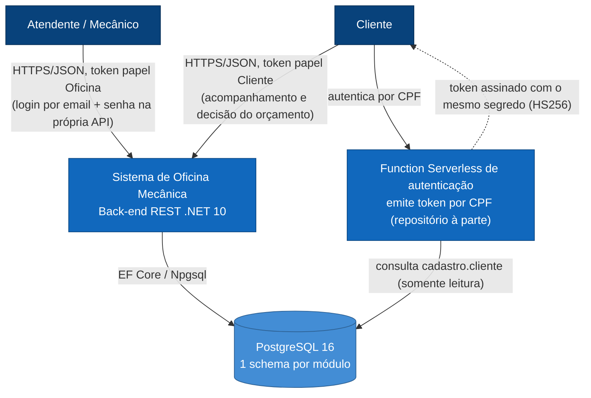
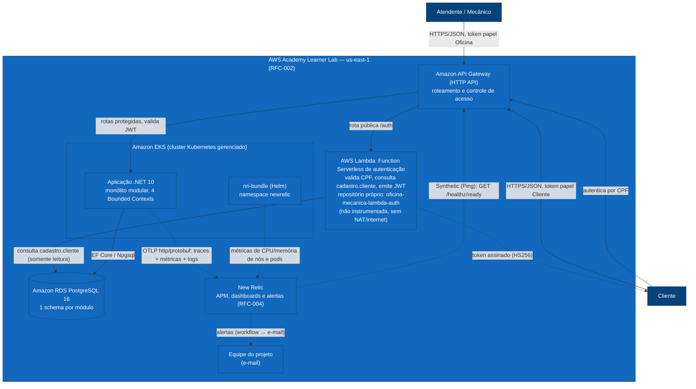

# Desenho — Componentes da Aplicação

> Modelo C4 (níveis 1 → 4) do **Sistema de Oficina Mecânica**, um _Modular Monolith_ em
> .NET 10 com quatro Bounded Contexts e aderência à Clean Architecture. O nível 4
> (implantação em nuvem) mostra a topologia já provisionada na AWS ([RFC-002](../rfcs/002-escolha-do-provedor-de-nuvem.md))
> — ver [`infraestrutura.md`](infraestrutura.md) para o detalhamento completo (NLB, VPC Link,
> Secrets Manager, ECR e a divisão entre repositórios).
> Diagramas em [Mermaid](https://mermaid.js.org/) — renderizam nativamente no GitHub.
>
> Documentação de apoio: [`estrutura-do-projeto.md`](../estrutura-do-projeto.md),
> [`clean-architecture.md`](../clean-architecture.md).

---

## Nível 1 — Contexto

Quem usa o sistema e com o que ele fala. O sistema é um back-end único (não há integrações
externas reais: e-mail é simulado e o barramento de eventos é in-process).

**Dois emissores de token, autorização por papel.** A aplicação emite o token do atendente
(`POST /api/v1/auth/login`, papel `Oficina`); a Function Serverless emite o token do cliente a
partir do CPF (papel `Cliente`). Ambos são HS256 com o mesmo segredo e distinguidos por `iss` e
pela claim `role` — ver [RFC-001](../rfcs/001-estrategia-de-autenticacao.md),
[ADR-001](../adrs/001-jwt-hs256-segredo-compartilhado.md) e
[ADR-003](../adrs/003-dois-emissores-e-autorizacao-por-papel.md). A consulta da OS pelo cliente
**deixou de ser pública**: hoje é autenticada e restrita ao dono da OS.

---

## Nível 2 — Containers (módulos)

O monólito roda em **um único container** (`Bootstrap/Api`), mas internamente é dividido em
quatro Bounded Contexts com fronteiras **físicas** (assembly próprio por camada por módulo) —
não em camadas horizontais. O `SharedKernel` fornece os tipos-base e o pipeline transversal.

**Comunicação entre módulos** (nenhum módulo referencia Domain/Application de outro):

| Tipo | Quando | Mecanismo |
|---|---|---|
| **Síncrona (ACL)** | precisa de resposta imediata (ex.: cliente existe ao abrir OS) | _port_ no Domain do consumidor + _adapter_ na Infrastructure consumindo os `Contracts` do produtor |
| **Assíncrona (Integration Events)** | fato consumado que outro BC reage (ex.: orçamento gerado → baixa estoque) | evento em `<Modulo>.Contracts` publicado no `IIntegrationEventBus` após o commit |

---

## Nível 3 — Componentes de um módulo (Clean Architecture)

Recorte do módulo **OrdemServico** (o mais completo). Cada anel da Clean Architecture é um
projeto físico; a Regra de Dependência é forçada em compile-time — as setas apontam sempre
para dentro.

**Persistência sem acoplar o Domain (DTOs de persistência):** o EF Core mapeia **Records**
(`OrdemServicoRecord`, etc., em `Adapters/DataSources/Records`), **nunca o agregado de Domain**.
O `DbContext`, as `Configurations` e o `Repository` da Infrastructure só conhecem Records; o
`Mapper` (`Adapters/DataSources/Mappers`) converte Record ↔ Domain dentro do Gateway. Assim o
Domain não tem nenhuma referência a EF/Npgsql. _(refatoração da Fase 2 — ver
[`../../planos/refatoracao-clean-architecture/07-plano-dtos-persistencia.md`](../../planos/refatoracao-clean-architecture/07-plano-dtos-persistencia.md).)_

**Por que Contracts é um pacote à parte (fora dos 4 anéis):** `OrdemServico.Contracts` é a
**interface pública publicada do módulo** — queries síncronas, DTOs e integration events que
**outros** Bounded Contexts consomem. Não é Domain (não tem entidades), nem Application (não tem
use cases), nem Adapters/Infrastructure. Depende **apenas de `SharedKernel.Domain`** e por isso é
um projeto separado, referenciado tanto por este módulo (a Application publica os integration
events; a Infrastructure implementa as queries) quanto pelos módulos consumidores. É o
equivalente à "linguagem publicada" do BC.

**Regra de Dependência** — referências permitidas por camada:

| Camada | Depende de |
|---|---|
| **Domain** | `SharedKernel.Domain` apenas |
| **Application** | Domain, SharedKernel.*, Contracts (próprios e de outros módulos) |
| **Adapters** | Application, Domain, Contracts, MediatR — **sem ASP.NET/EF** |
| **Contracts** | `SharedKernel.Domain` apenas |
| **Infrastructure** | Application, Domain, Contracts, Adapters, EF/Npgsql |
| **Web** | Adapters, SharedKernel.* |

> Detalhamento em [`estrutura-do-projeto.md`](../estrutura-do-projeto.md) e
> [`clean-architecture.md`](../clean-architecture.md).

---

## Nível 4 — Implantação em Nuvem (AWS Academy Learner Lab)

A Fase 3 exige que este diagrama de componentes ganhe uma **visão de nuvem**: API Gateway, banco
de dados, Kubernetes, Function Serverless e monitoramento. O diagrama abaixo é uma visão de
**implantação** (deployment), não mais de código — mostra onde cada componente roda e como eles se
falam na AWS, provedor decidido e implementado conforme
[RFC-002](../rfcs/002-escolha-do-provedor-de-nuvem.md) (Status: Aprovado).

**Legenda:** todas as caixas deste diagrama estão **implementadas e provisionadas hoje** — não há
mais itens-alvo pendentes neste nível.

**Estado atual: tudo provisionado.** Desde a decisão do [RFC-002](../rfcs/002-escolha-do-provedor-de-nuvem.md)
(AWS, conta AWS Academy Learner Lab) e sua execução, os cinco componentes exigidos pela Fase 3
estão implementados e no ar: o **Amazon API Gateway** (`gateway`, HTTP API), a **Function
Serverless** de autenticação (`authFn`, AWS Lambda — ver
[ADR-005](../adrs/005-quatro-repositorios-e-estrategia-de-branches.md)), o **cluster Kubernetes
gerenciado** (`k8s`, Amazon EKS) rodando a aplicação (`app`), o **banco de dados gerenciado**
(`db`, Amazon RDS PostgreSQL) e a ferramenta de observabilidade (`apm`, **New Relic** — decidida e
implementada no [RFC-004](../rfcs/004-ferramenta-de-observabilidade.md)): a aplicação já emite
traces, métricas e logs via OpenTelemetry/OTLP e já expõe health checks, e esse tráfego já vai
para o New Relic em produção. Este diagrama simplifica a topologia para o nível de componentes; o
desenho completo — NLB interna, VPC Link, NodePort, Secrets Manager, ECR e a divisão do Terraform
entre os três repositórios de infraestrutura — está em [`infraestrutura.md`](infraestrutura.md).

A **Function Serverless não é instrumentada**: roda em subnet sem NAT Gateway, sem alcance à
internet para exportar OTLP (ADR-004, RFC-004).

**Sobre o provedor:** a escolha é **AWS**, decidida e registrada no
[RFC-002](../rfcs/002-escolha-do-provedor-de-nuvem.md) (Status: Aprovado) — ver lá as restrições
reais da conta AWS Academy Learner Lab (seção 6: sem criação de IAM role própria, VPC default sem
NAT Gateway, limites de dimensionamento) que moldam esta topologia.
