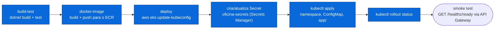

# Desenho — Fluxo de Deploy (CI/CD)

> Pipeline de integração e entrega contínua no **GitHub Actions**, publicando na infraestrutura de
> nuvem persistente (AWS Academy Learner Lab — ver
> [`infraestrutura.md`](infraestrutura.md)): build → teste → imagem (**Amazon ECR**) → deploy no
> **EKS** → smoke test via **API Gateway**. O cluster kind efêmero da Fase 2 (criado dentro do
> runner a cada push) foi removido — o cluster agora é persistente e gerenciado pelo repositório
> `oficina-mecanica-infra-k8s`, fora deste.
>
> Workflows: [`../../../.github/workflows/ci.yml`](../../../.github/workflows/ci.yml) (PRs) e
> [`../../../.github/workflows/ci-cd.yml`](../../../.github/workflows/ci-cd.yml) (push na `main` e
> `workflow_dispatch`).
> Plano original (Fase 2, cluster kind) em
> [`../../planos/infra-fase-2/04-cicd.md`](../../planos/infra-fase-2/04-cicd.md) — documento
> histórico, mantido como registro do que existiu, não como estado atual.

---

## Etapas do `ci-cd.yml`

| Job | Depende de | O que faz |
|---|---|---|
| **build-test** | — | `dotnet restore/build --configuration Release` + `dotnet test` |
| **docker-image** | build-test | autentica na AWS (credenciais de sessão), login no **Amazon ECR**, `docker build` a partir da raiz, push com a tag do `${{ github.sha }}` |
| **deploy** | docker-image | `aws eks update-kubeconfig` → aplica `k8s/base/00-namespace.yaml` → cria/atualiza o `Secret` `oficina-secrets` a partir dos segredos do Secrets Manager (lidos por nome) → aplica `k8s/base/01-configmap.yaml` e `k8s/app/` (com a imagem recém-publicada) → `kubectl rollout status` → **smoke test** em `/healthz/ready`, via o endpoint do API Gateway descoberto pelo **nome** |

**Credenciais:** `aws-actions/configure-aws-credentials`, com as **três credenciais de sessão
temporárias** da conta AWS Academy Learner Lab (`AWS_ACCESS_KEY_ID`, `AWS_SECRET_ACCESS_KEY`,
`AWS_SESSION_TOKEN` — este último obrigatório, ver
[ADR-006](../adrs/006-credenciais-de-nuvem-no-cicd.md), repositório `oficina-mecanica-app`).
Nenhum valor de `oficina-secrets` é impresso no log (`::add-mask::` em cada um antes do primeiro
uso).

A infraestrutura em si (cluster EKS, NLB, API Gateway, ECR, RDS) **não é criada por este
workflow** — ela já existe, provisionada pelos repositórios `oficina-mecanica-infra-k8s` e
`oficina-mecanica-infra-db` (ver [Ordem de deploy no README](../../../README.md#deploy-na-nuvem-aws)).

## Deploy manual / reexecução

`workflow_dispatch` existe especificamente para reexecutar o `deploy` depois de renovar as
credenciais de sessão da AWS Academy (ADR-006), sem precisar de um commit novo — **um job que
falha na autenticação não é pipeline quebrada**, é sessão expirada.

Para descobrir a URL pública da API e testar manualmente, ou recuperar a senha do admin, ver os
comandos em [Deploy na Nuvem (AWS), no README principal](../../../README.md#deploy-na-nuvem-aws).
Demonstração de escalabilidade automática (teste de carga → HPA escala): ver o vídeo referenciado
no [README principal](../../../README.md).
