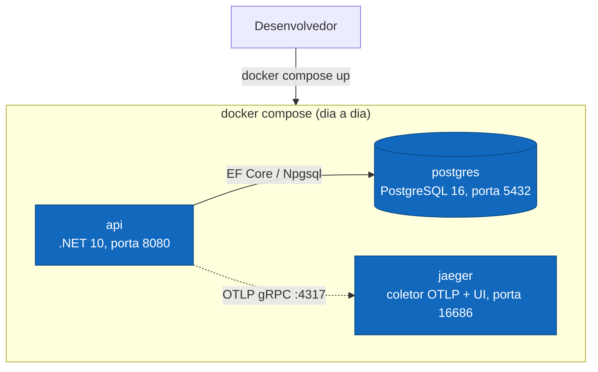
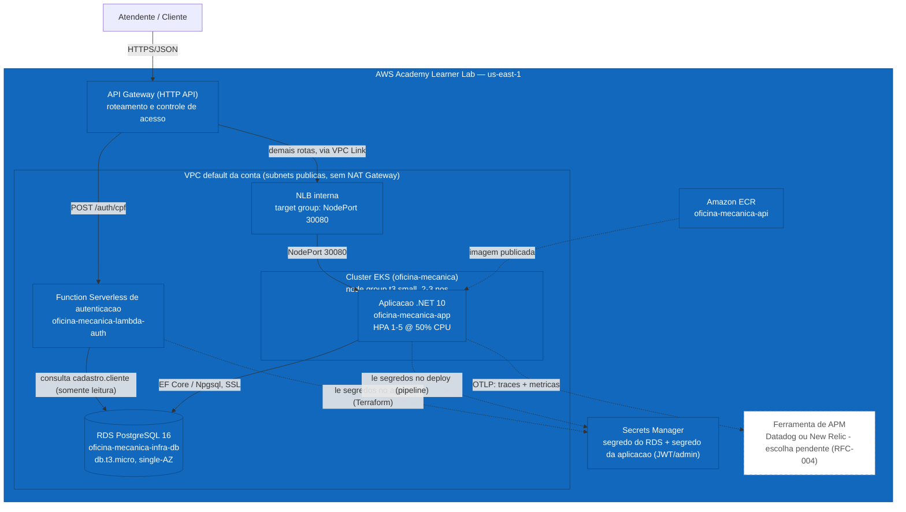

# Desenho — Infraestrutura

> Existem **dois ambientes** neste projeto: o **local de desenvolvimento** (`docker compose`, sem
> Kubernetes) e o **de produção, na nuvem** — AWS Academy Learner Lab, exigido pela Fase 3.
> O cluster **kind** local usado na Fase 2 (e na pipeline de CI/CD daquela fase) foi removido: a
> infraestrutura de nuvem é persistente e gerenciada pelos repositórios de infra, não recriada a
> cada execução do CI.
>
> Diagramas em [Mermaid](https://mermaid.js.org/) — renderizam nativamente no GitHub.

---

## Ambiente local de desenvolvimento

Uma única forma de rodar o projeto localmente: **`docker compose up`**, para desenvolvimento e
testes manuais do dia a dia. Sobe `postgres`, `api` e `jaeger` (coletor OTLP + UI, ver
[Observabilidade no README](../../../README.md#observabilidade-opentelemetry)). Sem Kubernetes —
a validação de manifestos Kubernetes acontece hoje contra o cluster de nuvem, não localmente.

> Detalhes de decisão do cluster kind removido (Fase 2) em
> [`../../planos/infra-fase-2/00-visao-geral.md`](../../planos/infra-fase-2/00-visao-geral.md) —
> documento histórico, mantido como registro do que existiu, não como estado atual.

---

## Ambiente de produção: nuvem (AWS Academy Learner Lab)

A Fase 3 exige infraestrutura de nuvem de verdade: API Gateway, Function Serverless, banco de
dados gerenciado, cluster Kubernetes gerenciado com escalabilidade e tudo provisionado por
Terraform — decisão de provedor em [RFC-002](../rfcs/002-escolha-do-provedor-de-nuvem.md)
(**AWS**, conta AWS Academy Learner Lab).

**Legenda:** só a caixa do APM (`apm`) está com borda tracejada — a ferramenta ainda não foi
escolhida (RFC-004). Todo o resto do diagrama está **provisionado**: cluster EKS, NLB, API
Gateway, ECR e o segredo da aplicação nascem em `oficina-mecanica-infra-k8s`; o RDS e seu segredo
em `oficina-mecanica-infra-db`; a Function e sua rota no API Gateway em
`oficina-mecanica-lambda-auth`; a imagem e os manifestos da API neste repositório
(`oficina-mecanica-app`).

**Topologia de repositórios** (ver
[ADR-005](../adrs/005-quatro-repositorios-e-estrategia-de-branches.md)): o Terraform deste
ambiente se divide em três repositórios — `oficina-mecanica-infra-k8s` (cluster, rede, NLB, API
Gateway, ECR e segredo da aplicação), `oficina-mecanica-infra-db` (banco gerenciado e seu segredo)
e `oficina-mecanica-lambda-auth` (a Function, seu security group e sua rota no API Gateway) — que
publicam outputs (endpoint do banco, nome do cluster, id da API, security groups) consumidos entre
si e por `oficina-mecanica-app` via estado remoto (`terraform_remote_state`). Nenhum deles cria
VPC própria: todos usam a VPC default da conta AWS Academy Learner Lab via `data` sources — ver
[RFC-002](../rfcs/002-escolha-do-provedor-de-nuvem.md) ("Atualização — VPC default").

**Diferenças em relação ao ambiente local:**

| Peça | Local (`docker compose`) | Nuvem (produção) |
|---|---|---|
| Cluster Kubernetes | Nenhum (a API roda direto em contêiner) | **EKS**, gerenciado, com node group escalável |
| Banco de dados | PostgreSQL em contêiner, volume Docker | **RDS PostgreSQL 16**, gerenciado, fora do cluster |
| Entrada de tráfego | Porta exposta direto no host (`8080`) | **API Gateway** com roteamento e controle de acesso, via NLB interna |
| Autenticação por CPF | Assinatura manual de JWT (sem Function rodando) | **Function Serverless** real, atrás do API Gateway |
| Segredos | Variáveis de ambiente do `docker-compose.yml` | **Secrets Manager**, resolvidos no apply/deploy — nunca commitados |
| Telemetria (destino) | Jaeger local (`docker compose`) | Ferramenta de APM (Datadog ou New Relic — escolha pendente, RFC-004) |
| Terraform | Não se aplica | State remoto (S3), um repositório por peça de infraestrutura |

A aplicação já exporta OTLP e já expõe health checks — isso **não muda** entre os dois ambientes,
só o destino do OTLP e o que está por trás do Kubernetes muda. Ver
[Observabilidade no README](../../../README.md#observabilidade-opentelemetry) e
[`metricas.md`](../metricas.md) para o que já é emitido pela aplicação hoje, independente de onde
ela roda.
