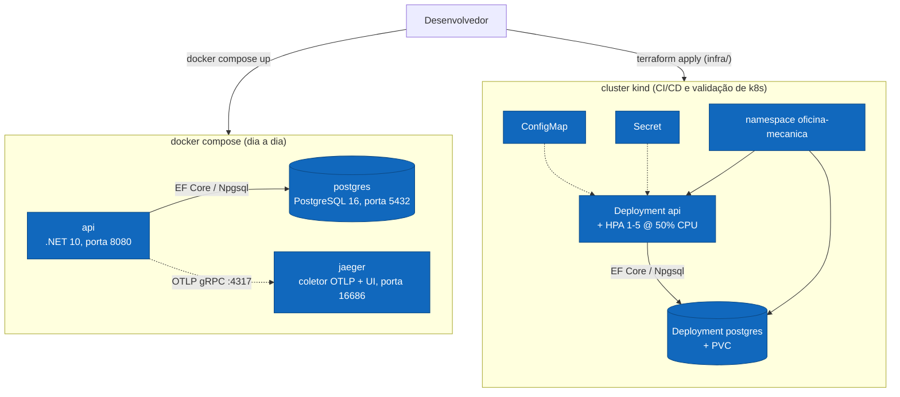
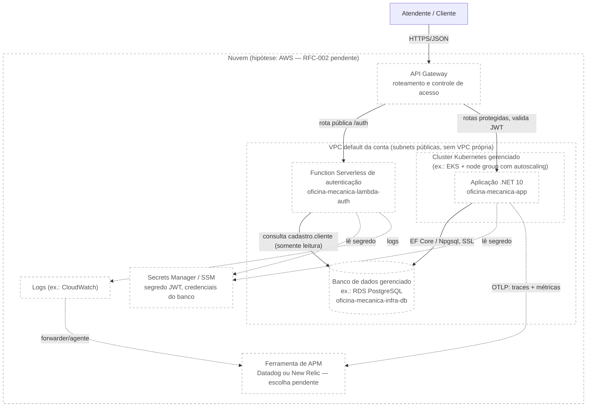

# Desenho — Infraestrutura

> Existem **dois ambientes** neste projeto: o **local de desenvolvimento**, que é o que roda hoje
> (kind + `docker compose`), e o **alvo em nuvem**, exigido pela Fase 3 e ainda não provisionado.
> Este documento descreve os dois, deixando explícito qual é qual — um diagrama que apresenta
> infraestrutura de nuvem inexistente como se estivesse pronta é pior do que nenhum diagrama.
>
> Diagramas em [Mermaid](https://mermaid.js.org/) — renderizam nativamente no GitHub.

---

## Ambiente local de desenvolvimento (o que funciona hoje)

Duas formas de rodar o projeto localmente, para propósitos diferentes:

- **`docker compose up`** — dia a dia de desenvolvimento. Sobe `postgres`, `api` e `jaeger`
  (coletor OTLP + UI, ver [Observabilidade no README](../../../README.md#observabilidade-opentelemetry)).
  Sem Kubernetes.
- **Cluster kind** — validação de Kubernetes e o que roda na pipeline de CI/CD hoje
  (`ci-cd.yml`: builda a imagem, sobe um kind efêmero no runner, aplica os manifestos via
  Terraform, roda smoke test, destrói o cluster).

**Recursos provisionados pelo Terraform (`infra/`) no cluster kind:**

| Recurso Terraform | Tipo | O que cria |
|---|---|---|
| `kind_cluster.this` | `kind_cluster` | Cluster kind com NodePort 30080 mapeado para `localhost:30080` |
| `helm_release.metrics_server` | `helm_release` | metrics-server em `kube-system` (habilita o HPA) |
| `kubectl_manifest.namespace` | `kubectl_manifest` | Namespace `oficina-mecanica` |
| `kubectl_manifest.configmap` | `kubectl_manifest` | ConfigMap com variáveis **não** sensíveis |
| `kubectl_manifest.secret` | `kubectl_manifest` | Secret com credenciais do banco/JWT |
| `kubectl_manifest.postgres_pvc` | `kubectl_manifest` | PersistentVolumeClaim do PostgreSQL |
| `kubectl_manifest.postgres_deployment` | `kubectl_manifest` | Deployment do PostgreSQL 16 |
| `kubectl_manifest.postgres_service` | `kubectl_manifest` | Service ClusterIP do PostgreSQL |
| `kubectl_manifest.api_deployment` | `kubectl_manifest` | Deployment da API (imagem via `var.api_image`) |
| `kubectl_manifest.api_service` | `kubectl_manifest` | Service NodePort 30080 da API |
| `kubectl_manifest.api_hpa` | `kubectl_manifest` | HorizontalPodAutoscaler da API |

**Pontos de projeto que sustentam o desenho:**

- **HPA por CPU (50%)**, `min 1 / max 5`. Depende do `resources.requests.cpu` no container da
  API e do metrics-server — ambos presentes.
- **initContainer `wait-for-postgres`**: a API roda `MigrateAsync` no startup e falha se o banco
  não estiver pronto; o initContainer evita `CrashLoopBackOff`.
- **Credenciais consistentes**: `POSTGRES_USER/PASSWORD` do banco e `ConnectionStrings__Default`
  da API saem da **mesma** Secret.
- **Imagem no cluster**: local via `kind load docker-image` · CI via Docker Hub público
  (`imagePullPolicy: IfNotPresent`).
- Todo o cluster kind é provisionado **100% por Terraform** (`kind_cluster`, `helm_release`,
  `kubectl_manifest`, sem `local-exec`), com `terraform.tfstate` local. O banco PostgreSQL roda
  **dentro do cluster** — decisão adequada a um cluster efêmero, mas que muda no ambiente alvo
  (ver abaixo).

> Escalabilidade automática demonstrada por teste de carga (o HPA sobe as réplicas da API).
> Detalhes de decisão em [`../../planos/infra-fase-2/00-visao-geral.md`](../../planos/infra-fase-2/00-visao-geral.md);
> passo a passo em [`../../../infra/README.md`](../../../infra/README.md);
> pipeline em [`fluxo-deploy.md`](fluxo-deploy.md).

---

## Ambiente alvo: nuvem (Fase 3 — ainda não provisionado)

A Fase 3 exige infraestrutura de nuvem de verdade: API Gateway, Function Serverless, banco de
dados gerenciado, cluster Kubernetes gerenciado com escalabilidade e tudo provisionado por
Terraform — ver
[`docs/planos/fase-3/00-analise-da-spec.md`](../../planos/fase-3/00-analise-da-spec.md), seção
3.1, para a lista completa de recursos previstos.

**Nada abaixo está provisionado hoje.** Não existe Terraform de nuvem, não existe cluster
gerenciado, não existe banco gerenciado e não existe API Gateway. O diagrama descreve o alvo, não
o estado atual.

**Sobre o provedor:** o desenho usa AWS como rótulo porque é a **hipótese de trabalho** dos
planos da fase — a decisão formal de provedor é do **RFC-002**, ainda pendente. Se o RFC decidir
por outra nuvem, os nomes de serviço mudam, mas as peças (gateway, função serverless, banco
gerenciado, cluster gerenciado, Terraform, APM) permanecem as mesmas.

**Legenda:** todas as caixas do ambiente de nuvem estão com borda tracejada porque **nada delas
está provisionado** — nem mesmo `api` e `authFn`, que já têm código pronto em seus repositórios
(ver a seção "Nível 4 — Implantação em Nuvem" em [`componentes.md`](componentes.md)), mas ainda
não rodam em nenhuma nuvem: rodam hoje no ambiente local descrito acima.

**Topologia de repositórios** (ver
[ADR-005](../adrs/005-quatro-repositorios-e-estrategia-de-branches.md)): o Terraform deste alvo
se divide em dois repositórios — `oficina-mecanica-infra-k8s` (cluster + node groups + API
Gateway) e `oficina-mecanica-infra-db` (banco gerenciado) — que publicam outputs (endpoint do
banco, nome do cluster) consumidos pelos repositórios `oficina-mecanica-lambda-auth` e
`oficina-mecanica-app` via estado remoto. Nenhum dos dois cria VPC própria: ambos usam a VPC
default da conta AWS Academy Learner Lab via `data` sources — ver
[RFC-002](../rfcs/002-escolha-do-provedor-de-nuvem.md) ("Atualização — VPC default").

**Diferenças concretas em relação ao ambiente local:**

| Peça | Hoje (local) | Alvo (nuvem) |
|---|---|---|
| Cluster Kubernetes | kind, efêmero, um nó | Gerenciado, com autoscaling de nós |
| Banco de dados | PostgreSQL em pod, PVC local | Serviço gerenciado (ex.: RDS), fora do cluster |
| Entrada de tráfego | NodePort direto | API Gateway com roteamento e controle de acesso |
| Segredos | `Secret` do Kubernetes, commitado em `k8s/base/02-secret.yaml` | Secrets Manager/SSM, injetado no cluster |
| Telemetria (destino) | Jaeger local (`docker compose`) | Ferramenta de APM (Datadog ou New Relic — escolha pendente) |
| Terraform | State local, provisiona kind | State remoto (S3 + lock), provisiona recursos de nuvem |

A aplicação já exporta OTLP e já expõe health checks — isso **não muda** entre os dois ambientes,
só o destino do OTLP e o que está por trás do Kubernetes muda. Ver
[Observabilidade no README](../../../README.md#observabilidade-opentelemetry) e
[`metricas.md`](../metricas.md) para o que já é emitido pela aplicação hoje, independente de onde
ela roda.
